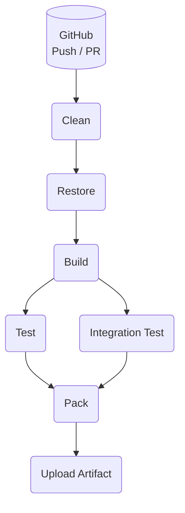

# 2022 MVP2MVP Day - Cake

Code sample from 2022 MVP2MVP Day talk GitHub Actions DevOps Pipelines as code using C#

```diff

+ ============================================================= +
+  __  __  __     __  ____    ____    __  __  __     __  ____   +
+ |  \/  | \ \   / / |  _ \  |___ \  |  \/  | \ \   / / |  _ \  +
+ | |\/| |  \ \ / /  | |_) |   __) | | |\/| |  \ \ / /  | |_) | +
+ | |  | |   \ V /   |  __/   / __/  | |  | |   \ V /   |  __/  +
+ |_|  |_|    \_/    |_|     |_____| |_|  |_|    \_/    |_|     +
+ ============================================================= +

```

## What is Cake?

[Cake](https://cakebuild.net/) is a free and open source cross-platform build automation system with a C# DSL for tasks such as compiling code, copying files and folders, running unit tests, compressing files and building NuGet packages.

- 🔀 Cross platform 
  - Mac
  - Windows
  - Linux
- 🔀 Cross environment 
  - Local
  - OnPrem
  - Cloud
  - Container
- 🔀 Cross service
  - Azure DevOps
  - GitHub Actions
  - AppVeyor
  - TeamCity
  - Bitbucket
  - Travis
  - etc.
- 🧾 Open source
- 🔨 Build orchestration framework
- 🪧 C# DSL / Console

## Benefits

- ♾️ Improved DevOps feedback loop
- ♻️ Reuse patterns you know
- ☯️ Consistent experience
- 🚦Low Ceremony
- 🤩Joyful experience

## Sample flow

